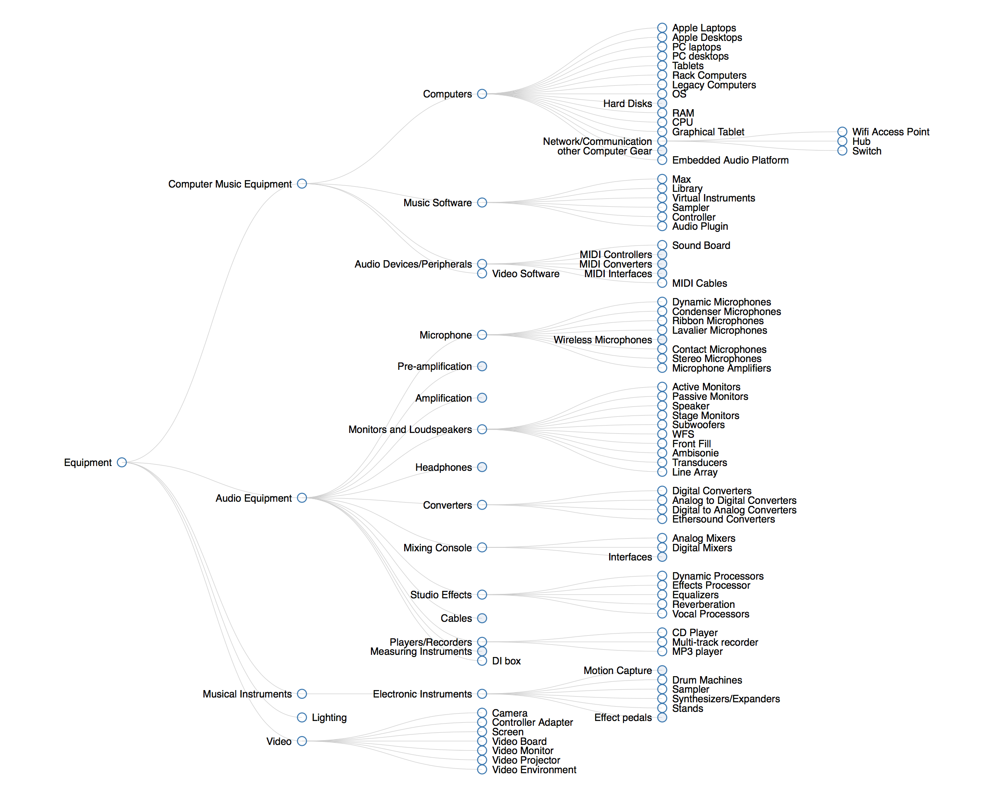
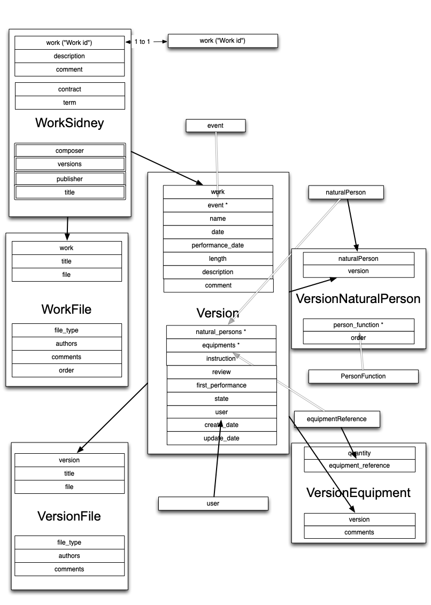

# musica2-gt4
Consortium HumaNum/Musica 2 : 

documents du GT 4 (Archives et numérisation de la musique contemporaine) 

Pour faire suite aux journées du consortium Musica2 qui se sont tenues du 3 au 5 juillet 2023 au CESR, Université de Tours, on trouvera ici les documents du **groupe de travail 4** consacré aux questions suivantes : 

- un thesaurus pour les musiques électroacoustiques 
- une ontologie pour la musique contemporaine
- Les questions de représentation et d’encodage
- la problématique des droits d’usage des archives, les questions juridiques ...
- les méthodes et recommandations concernant l'archivage et de numerisation de supports numeriques obsoletes
- ...

## Thesaurus
cf : [http://ears.huma-num.fr](http://ears.huma-num.fr/7310a277-f904-431e-a9cb-5d5e83042217.html)

[rdf version]()

à croiser/completer avec la taxonomie des "equipments" de brahms.ircam.fr/sidney 

## Ontologie
repartir de [Doremus](https://github.com/DOREMUS-ANR/doremus-ontology) ?

## modeles de donnée du projet Antony/Sidney

Voir aussi : [antony data model](https://miro.com/app/board/uXjVM4nqfrs=/)

## droits
étude juridique Antony/CNSMDP ?

## Mailing list
* tiffon@prism.cnrs.fr
* Pierre Couprie <pierre.couprie@univ-evry.fr>
* Jean-François Trubert <Jean-Francois.Trubert@unice.fr>
* Laurent Pottier <laurent.pottier@univ-st-etienne.fr>
* Alain Bonardi <alain.bonardi@univ-paris8.fr>
* jacques warnier <jcqs.wrnr@gmail.com>,
* cyrille.delhaye@gmx.fr>
* michel buffa <michel.buffa@unice.fr>
* Julie Mansion-vaquié <julie.mansion-vaquie@univ-cotedazur.fr>
* Yann ORLAREY <orlarey@grame.fr>
* Viviane Waschbusch <viviane.waschbusch@univ-st-etienne.fr>
* Serge Lemouton <Serge.Lemouton@ircam.fr>
* Maxence Mercier <maxence.mercier@yahoo.com>
* Arthur Macé <amace@cnsmdp.fr>
* Kevin Dahan <kevin.dahan@univ-eiffel.fr>
* ariane.couture2@usherbrooke.ca
* Thomas Bottini <thomas.bottini@cnrs.fr>

## bibliographie

- Barthelemy, J., Bonardi, A., Orlarey, Y., Lemouton, S., Ciavarella, R., & Barkati, K. (2010). Toward An Organology Of Virtual Instruments In Computer Music. In ICMC 2010, New York & Stony Brook, USA, 2010 (pp. 369-372). ()
“The amount of work towards an organology should not be underestimated. Not only the adequate descriptors have to be extracted, not only the adequate data mining methods have to be applied, but also a proactive methodology is to be defined: the “organology” we expect can not simply emerge from data. We will use an empirical methodology: adequate theories have to be defined, and validated (or rejected) on the basis of the analysis of the repository. It is not the purpose of this article to expose these theories. 
This is certainly a long way, and we will probably not achieve it completely in the ASTREE project, but merely will make some steps forward in that direction. “

- Lemouton, S., Bonardi, A., & Ciavarella, R. (2009). Peut-on envisager une organologie des instruments virtuels de l'informatique musicale ?. In conference on interdisciplinary musicology, Paris, 2009. ()
“Une organologie nouvelle doit donc émerger, incluant aussi bien les instruments acoustiques que les boîtiers électroniques ou encore les modules logiciels. Elle sera par nature pluri-disciplinaire, car nécessitant la collaboration de musicologues, de réalisateurs en informatique musicale, de scientifiques et d’informaticiens. Parmi les questions qui la traverseront, deux nous semblent émerger : 
−  la question de la classification ; 
−  la question de l’authenticité. “
- Vine, B. (2010). Avoiding Extinction in the Instrument Zoo: A taxonomical and ontological approach to developing an understanding of the ecosystem of electroacoustic instruments. Organised Sound, 15(02), 167-177.
- Vincent, A., Bachimont, B., & Bonardi, A. (2014). {L'intérêt des patrons dans la gestion des connaissances liées à la création sonore}. In {IC - 25èmes Journées francophones d'Ingénierie des Connaissances}, Clermont-Ferrand, France, 2014 (pp. 63-74). (https://hal.inria.fr/hal-01015188)
- IFLA (). Definition of FRBROO Definition of FRBROO - A Conceptual Model for Bibliographic Information in Object-Oriented Formalism. Retrieved from https://www.ifla.org/files/assets/cataloguing/FRBRoo/frbroo_v_2.4.pdf.
- ...